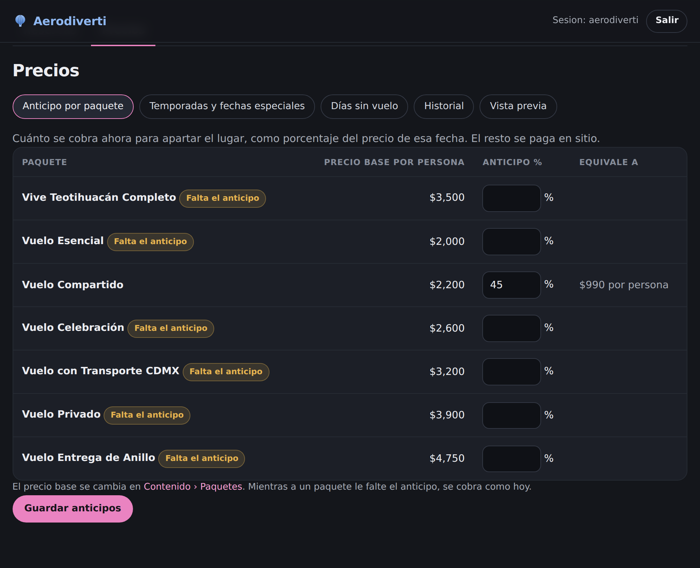
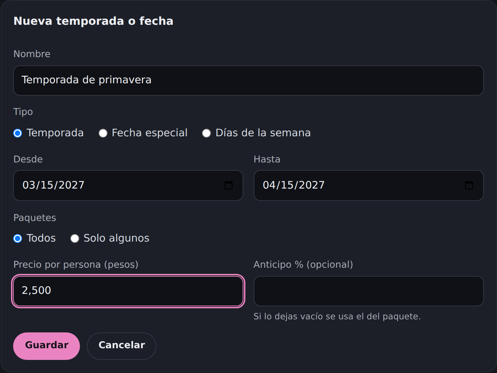
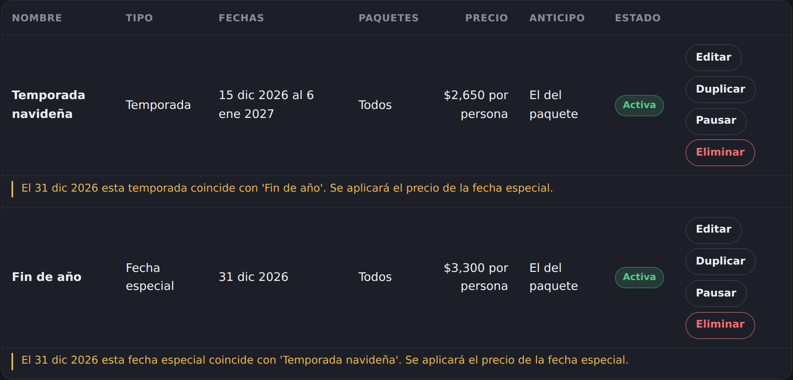
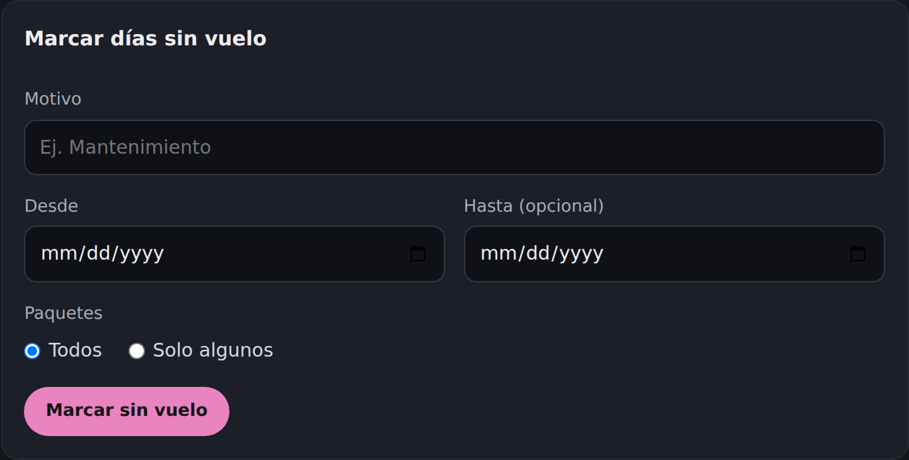
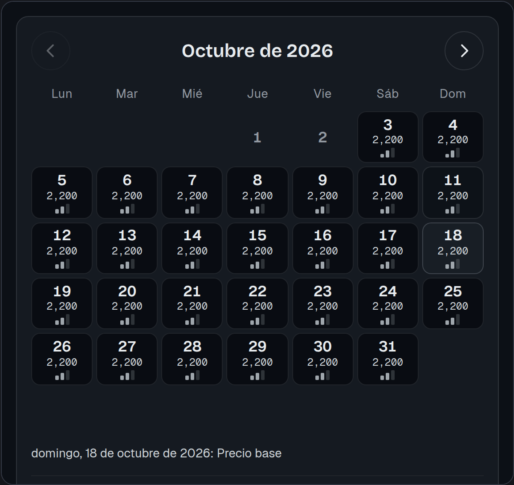

# Guía rápida: precios por fecha

Para Berenice. Todo se hace en el panel de ventas, en la pestaña **Precios**: entra a `/api/panel.php` con tu
usuario y contraseña de siempre y haz clic en **Precios**, arriba.

## 1. Anticipo por paquete (lo primero)

Es cuánto se cobra al apartar, como porcentaje del precio de esa fecha. El resto se paga en sitio.

1. Pestaña **Anticipo por paquete**.
2. Escribe el % de cada paquete. A la derecha ves cuánto equivale por persona.
3. **Guardar anticipos**.

Mientras un paquete diga **"Falta el anticipo"**, ese paquete se cobra como hoy ($1,000 fijos por pasajero).
El precio base de cada paquete no se cambia aquí, sino en **Contenido › Paquetes**.

## 2. Crear una temporada, fecha especial o precio por días de la semana

1. Pestaña **Temporadas y fechas especiales** → **Nueva temporada o fecha**.
2. Escribe un nombre (por ejemplo "Temporada navideña") y elige el tipo:
   - **Temporada:** un rango de fechas.
   - **Fecha especial:** un día o unos pocos días (14 de febrero, 31 de diciembre).
   - **Días de la semana:** por ejemplo, sábados y domingos de octubre a diciembre.
3. Elige **Desde** y **Hasta**, los paquetes (Todos o solo algunos) y el **precio por persona** en pesos.
4. El **anticipo %** es opcional: si lo dejas vacío se usa el del paquete.
5. **Guardar**.

**Si dos se juntan el mismo día**, el panel te avisa en amarillo cuál precio se cobrará. La fecha especial
le gana a los días de la semana, y estos le ganan a la temporada.

En la lista puedes **Editar**, **Duplicar** (la copia queda pausada), **Pausar / Activar** y **Eliminar**.

## 3. Días sin vuelo

1. Pestaña **Días sin vuelo**.
2. Escribe el motivo (por ejemplo "Mantenimiento") y la fecha. **Hasta** es opcional, para cerrar varios días.
3. **Marcar sin vuelo**. Esos días no se pueden reservar.
4. Para volver a abrir un día: **Volver a abrir** en la lista.

El formato de las fechas (día/mes/año) depende de tu navegador. Haz clic en cualquier parte de la fecha y se abre
el calendario para elegirla.

## 4. Revisar antes de que lo vean los clientes

Pestaña **Vista previa**: elige un paquete y verás el mismo calendario que verá el cliente, con el precio de
cada día. Pasa el cursor sobre un día para ver qué precio se le aplica.

## Bueno saber

- **Recorrido guiado:** la primera vez que entras a cada pantalla del panel aparece un recorrido que explica
  cada parte y cada botón. Para verlo otra vez: **Ver recorrido**, arriba a la derecha.
- **Al guardar** suben unos globitos; si algo falla, un globo se revienta y el campo con problema queda en rojo.

- **Los precios por fecha se aplican al momento:** en cuanto guardas, el cobro ya usa el precio nuevo. El
  calendario del sitio puede tardar unos segundos en refrescarse.
- **El precio base** (Contenido › Paquetes) sí pasa por una publicación del sitio y no es instantáneo.
- **Si un cliente ya estaba por pagar** y cambias el precio de su fecha, el sitio le avisa del precio nuevo
  antes de cobrar.
- **Todo cambio queda en el Historial**: quién lo hizo, cuándo y qué cambió.
- Mientras los precios por fecha estén apagados para el público, lo que captures se guarda y se puede revisar
  en la Vista previa, pero los clientes siguen viendo el sitio como hoy.
